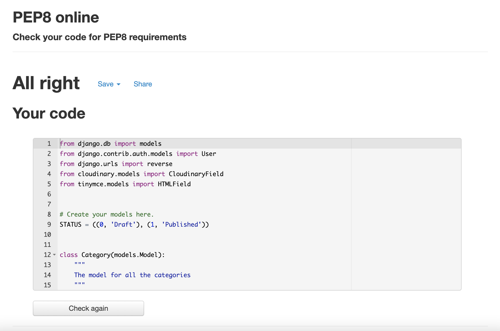
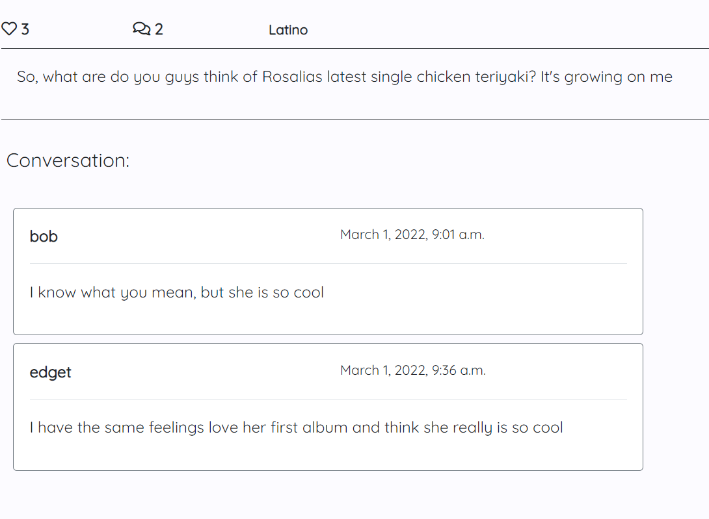
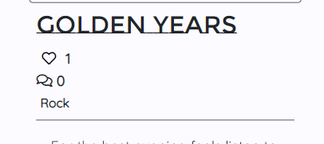

## Testing
There was always a tab open for testing with the website preview through Gitpod port 8000. To check up on my code and see if it worked as I wanted. 
I used DevTools to see how the code would respond if I added or changed properties or values with CSS or Bootstrap. I also took help from DevTools to check the responsiveness when decreasing or increasing the screen size.
To see and test the website's performance, I used Lighthouse, which gave me an updated report to see how well my performance, accessibility, and SEO were for the website. 

To see that the JavaScript code in the project worked without any bugs, I used the console section of DevTools to know that it rendered as it should. While working with JavaScript, I got an error message that the browser could not render the script.js file. That was because I was using the hard-code, not the Django format, and loading static at the top of the templates.

Several internet browsers, like Chrome, Mozilla Firefox, Microsoft Edge, and Safari, were used during all the testing. It works on all the mentioned internet browsers and mobile devices.

### Code Validation
* HTML
There are no errors form the offical [W3C Validatior](https://validator.w3.org/)
    
    
    Link to the validation: [W3C Validatior](https://validator.w3.org/nu/?doc=https%3A%2F%2Fcosmos-forum.herokuapp.com%2F)

* CSS
There are no errors form the offical [Jigsaw validator](https://jigsaw.w3.org/css-validator/), but warnings that I am aware of.
  

  
    
  Link to the validation: [Jigsaw validator](https://jigsaw.w3.org/css-validator/validator?uri=https%3A%2F%2Fcosmos-forum.herokuapp.com%2F&profile=css3svg&usermedium=all&warning=1&vextwarning=&lang=en)

* JavaScript
No errors where found when going through the offical [Jshint validator](https://jshint.com/).
 * There are 2 functions in this file.
 * Function with the largest signature take 1 arguments, while the median is 1.
 * Largest function has 1 statements in it, while the median is 1.
 * The most complex function has a cyclomatic complexity value of 1 while the median is 1.

    

* Python
The code passed through [PEP8 linter](http://pep8online.com/checkresult). The result confirmed there are no problems with the code.





### Browser Compatibility
* Google Chrome
  * The website runs without any issues in the Google Chrome browser

  

* Mozilla Firefox
  * The website runs without any issues in the Mozilla Firefox browser

  

* Microsoft Edge
  * The website runs without any issues in the Microsoft Edge browser

  

* Safari
  * The website runs without any issues in the Safari browser

  

### Responsiveness
#### From Desktop view
* The 'Home' view


* Blurb view 


* View of multiple posts


* The Footer with Social Media Icons


* The Log In form


* The Sign Up form


* The Log Out page


* The Category navbar


* The Add Post view


* The Post Detail view for Verified User


* The Post Detail view for Unverified User


* The Add Comment view


* The Most Popular Post view


* The Edit Post View


* The Delete Post View


* The Delete Post View


#### Form tablet view 
* The 'Home' view


* Blurb view 


* View of multiple posts


* The Footer with Social Media Icons


* The Log In form


* The Sign Up form


* The Log Out page


* The Category navbar


* The Add Post view


* The Post Detail view for Verified User


* The Post Detail view for Unverified User


* The Add Comment view


* The Most Popular Post view


* The Edit Post View


* The Delete Post View


#### Form mobile view
* The 'Home' view


* Blurb view 


* Menu/Navbar view


* The Log In view


* The Log Out view


* The Sign Up view


* The Add Post view 


* Post Detail View


* Edit Post view


* Delete Post view


* Add Comment view


* Comments view


* Most Popular Post view


* Footer and Pagination


* No Post yet view 


### Tested Code
This section go through the Django testing done to the project code.

#### The test codes from test_models.py:
```python
<from django.test import TestCase
from django.contrib.auth.models import User
from .models import Post, Comment, Category


class TestPostModel(TestCase):
    """
    Test the PostModel
    """
    @classmethod
    def setUpTestData(cls):
        test_user1 = User.objects.create_user(
            username='testuser1',
            password='3E!uhGre09Wq'
            )

        test_user1.save()

        Post.objects.create(
            title='Test title',
            slug='test-title',
            author=test_user1,
            category='test',
            image='placeholder',
            updated_on='2022.02.28',
            content='test text body',
            created_on='2022.02.27',
            status=1,
            )

    def test_title_max_length(self):
        """ test """
        post = Post.objects.get(id=1)
        max_length = post._meta.get_field('title').max_length
        self.assertEqual(max_length, 200)

    def test_slug_max_length(self):
        """ test """
        post= Post.objects.get(id=1)
        max_length = post._meta.get_field('slug').max_length
        self.assertEqual(max_length, 200)

    def test_get_absolute_url(self):
        """ test """
        post = Post.objects.get(id=1)
        self.assertEqual(post.get_absolute_url(), '/')


class TestCommentModel(TestCase):
    """ Test Comment model """
    @classmethod
    def setUpTestData(cls):
        test_user1 = User.objects.create_user(
            username='testuser1',
            password='3E!uhGre09Wq'
            )

        test_user1.save()

        test_post = Post.objects.create(
            title='Test title',
            slug='test-title',
            author=test_user1,
            category='test',
            image='placeholder',
            updated_on='2022.02.28',
            content='test text body',
            created_on='2022.02.27',
            status=1,
            )

        test_post.save()

        Comment.objects.create(
            user=test_user1,
            post=test_post,
            body='test comment body',
            created_on='2022.02.28',
            approved='False'
        )

    def test_default_approved_are_false(self):
        """ test """
        comment = Comment.objects.get(id=1)
        self.assertFalse(comment.approved)


class TestCategoryModel(TestCase):
    """ Test the Category Model """
    @classmethod
    def setUpTestData(cls):
        Category.objects.create(
            category_name='TestCategory'
        )

    def test_get_absolute_url(self):
        """ test """
        category = Category.objects.get(id=1)
        self.assertEqual(category.get_absolute_url(), '/')

    def test_category_name_max_length(self):
        """ test """
        category = Category.objects.get(id=1)
        max_length = category._meta.get_field('category_name').max_length
        self.assertEqual(max_length, 40)
>
```

#### The test code from test_views.py:
```python
<from django.test import TestCase
from django.contrib.auth.models import User
from django.urls import reverse
from .models import Post


# Create your tests here.
class TestViews(TestCase):
    """ Test the code for the views """
    @classmethod
    def setUpTestData(cls):
        test_user1 = User.objects.create_user(
            username='testuser1',
            password='3E!uhGre09Wq'
            )

        test_user1.save()

        Post.objects.create(
            title='Test title',
            slug='test-title',
            author=test_user1,
            category='test',
            image='placeholder',
            updated_on='2022.02.28',
            content='test text body',
            created_on='2022.02.27',
            status=1,
            # likes=likes.set(True)
            )

    def test_get_home_page(self):
        """ Test to get the right template for the view """
        response = self.client.get('/')
        self.assertEqual(response.status_code, 200)
        self.assertTemplateUsed(response, 'index.html', 'base.html')

    def test_get_get_post_page(self):
        """ Test to get the right template for the view """
        post = Post.objects.get(id=1)
        response = self.client.get(f'/post/{post.id}')
        self.assertEqual(response.status_code, 200)
        self.assertTemplateUsed(response, 'post_detail.html', 'base.html')

    def test_get_category_page_page(self):
        """ Test to get the right template for the view """
        response = self.client.get('/category/')
        self.assertEqual(response.status_code, 200)
        self.assertTemplateUsed(response, 'category.html', 'base.html')

    def test_get_mostlikedpost_page(self):
        """ Test to get the right template for the view """
        response = self.client.get('/popular_post/')
        self.assertEqual(response.status_code, 200)
        self.assertTemplateUsed(response, 'popular_post.html', 'base.html')
>
```

The result for the testing with Django testing of the view functions.


The result for the testing with Django testing of the models.


### Tested User Stories
This section provides the test done to check the User Stories for this project.

* Posts:
A Verified User/Admin can read, create, edit and delete a post to start a conversation with other Verified Users/Admin. 
An Unverified User/Visitor can only read posts. 

  * Verified User/Admin:
  Read post with and without comments

  

  

  Create post form

  

  Edit post form

  

  Delete post form

  

  * Unverified User:
  Read post with and without comments

  

  

  Add post: The User gets redirected to the Log In page

  

  Edit post

  

  Delete post

  

* Choose Category & Categories: 
A verified User/Admin can navigate through the category options available from the categories menu to find the relevant post about that topic.


* Post Comments: 
A Verified User/Admin can leave comments on posts to start or participate in conversations.


* View Comments: 
Any Visitor to the website can view comments on different posts and read the conversation. Note that if the User is not Verified, the 'Join in' button do not appear.



* Like/Vote/Unlike: 
A Verified User/Admin can Like/Vote and Unlike the like on a post to show their interest in the subject.




* View Likes: 
Any Visitor or Verified User/Admin can view the number of Likes/Votes a post has.


* View popular posts: 
A Visitor or Verified User/Admin can view on a designated page the post with the most Likes/Votes to see which are popular on the forum at the moment.


* Account Registration: 
A Visitor/Unverified User can sign up to become a community member/Verified User and access all the website's functionalities.


* Approve Comments: 
A Verified Admin to the website is the only one with access to approve comments before posting on the website, to filter out objectionable comments.


* Deleting of created Content: 
When a Verified User wants to delete made content, they get a notification with an option to change their mind or confirm they want to delete that content.


### Tested Features
This section shows the tests for the features of the website that are not related to the user stories. Please go to the Tested User Stories section above to see those tests.

* Menu/Navbar 
The first navbar shows the links to the home page through the Logo and 'Home' option, the sign up to become a Verified User and the link to login as Verified User/Admin. If a User verifies through login or signup, the navbar changes its links to 'Add Post' to add content and a 'Log out' link to log out from the website. 
The menu collapses when the screen size is 575px or lower and gets a hamburger icon that the User can click on to open the navbar.

  * Normal: 
  
  
  
  

  * Collapsed:
  
  
  
  

The second navbar for categories displays all the categories available on the website. When selected for the music genres categories, a drop-down function shows all the genres available. When Users select a category, they are redirected to a page whit all the posts. If there is no post available for that category, a message is displayed to the User to either login, create on themself or become a Verified User to make a post.
The menu collapses when the screen size is 575px or lower and gets a 'Categories'-button that the User can click on to open the navbar.
If the User is verified on the website and clicks on either the login link or signup link, they will get redirected to the 'Home' page. If they select the add post link, the User gets redirected to the 'Add Post' page.
When Unverified Users select either the login link or signup link, they will get redirected to those pages. If they choose to click on the add post link, they will get redirected to the Log In page.

* Category Menu Normal


* Category Menu Collapse 


* A Category page


* Redirect to Log In page


* Redirect to Sign Up page


* Redirect to Add Post page


* SignUp/LogIn/LogOut
  * SignUp: 
When Unverified User signup, the fields for Username and Password are required to fill in; if requirements do not meet the necessary input, a message displays above the input field, notifying the error. The User is also required to write the password twice when signing up. When the form requirements are correct, the User gets redirected to the 'Home' page. 

Note: that 'Fyll i det här fältet' means 'This field is required' in Swedish.


  * LogIn: 
The login form requires a valid username and password to log in to the website. If the required fields are not populated or username and password do not match, a notification will show above the input fields, telling the User what the error is. When the form requirements are correct, the User gets redirected to the 'Home' page.


  * LogOut: 
When a Verified User chooses to log out from the website, a message displays on the screen, asking if they are sure they want to log out or stay logged in on the website. When the User logs out, they get redirected to the 'Home' page. If a User chooses to stay logged in, they get redirected to the 'Home' page.


* Pagination
The home page and categories pages do not have working pagination. See Unfixed Bugs down belove to get the information regarding that matter.
The pagination for 'Most Liked Post' shows no errors. After fifteen posts, a 'Next' button appears and, when selected, takes the User to the next page. If there are more pages than two, both the 'Next' and 'Back' buttons will appear on the page. If the User is on the last page, only the 'Back' button will show and take the User back to the previous page.


* Footer with Social Media Icons
The Social Media Icons in the footer takes the User to that icon's Social Media home page and opens up in a new tab. 
If a User clicks on the Logo below the Social Media Icons, they get redirected to the Cosmos home page.

  * The Footer
  

  * The view to confirm links open in new tab
  

  * Spotify redirect link
  
  
  * Facebook redirect link
  
  
  * Twitter redirect link
  
  
  * Instagarm redirect link
  
  
  * SoundCloud redirect link
  
  
  * Youtube redirect link
  

### Unfixed Bugs
* Pagination
When trying to implement pagination to the function-based views, such as the home view and category view, the website would only show one post for that view. When writing the code for the pagination for that view, I tried to put the variables for pagination on different levels in the code but only managed to make it work by showing one post. For the templates, I tried other inputs for the ifs- and for-statements with the result as above. I'm sure that I can make it work as I practice. The images below shows some of the way I tried to build the code.


